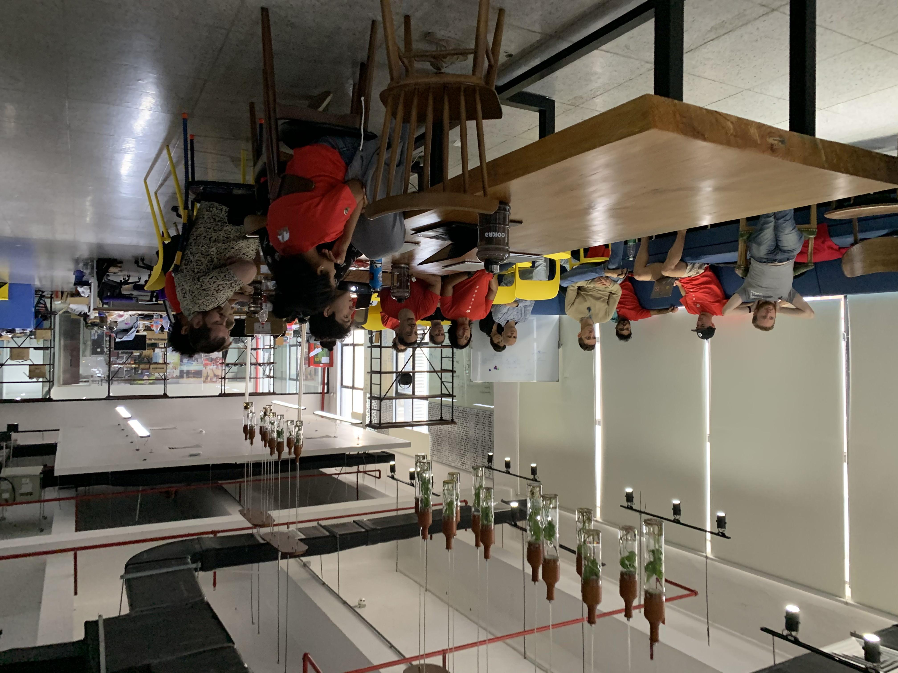
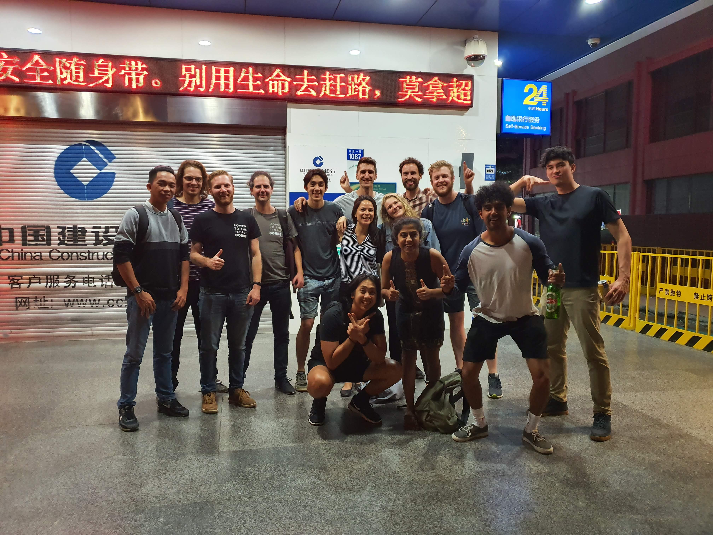

I've been working for a startup company (Okra Solar) for over four years now. It's quite different from all the big companies that I worked before. If I knew there are such thing as startups earlier in my career, I would have chose to work there instead. But I'm getting ahead of myself.

When I say startups, you might think about bean bag chairs, pingpong tables, free gym membership, and free food (we never had a bean bag chair but we had a [weird wooden chair](https://shopee.ph/Original-Ergonomic-Kneeling-Chair-Stool-Home-Office-Furniture-Ergonomic-Rocking-Wooden-Kneeling-Comp-i.415451519.4385432563) that would make you sit straight). It's really cool and all but that's only the tip of the iceberg 

Aside from the perks and freebies, there's a lot cool, crazy, chaotic, daunting, and fun things you might get to experience working for a startup. And I just written an article to share the challenges that I faced and rewards that I reaped while working for a cool startup like Okra. Are you ready? Let's start it up!

## 🏠 What is a startup company?

A startup is a company in the early stages of its development. It typically has less than 30 employees (we were only about 20 people working at Okra when I joined).

It usually is solving a problem. It has a vision. In it's own way, it's changing the world for the better. At Okra Solar, we are solving an energy problem. We are on a journey to eradicate energy poverty by ensuring everyone has access to electricity. Airbnb, Uber, and Netflix were all startups once, and they also are solving a specific problem.

Startup is also all about growth and innovation. Startups are not afraid to do something new, something different, that's why they are called "disruptors".

## 🏋️‍♂️ The Challenges

Working for a startup is not for the faint of heart. Working on something new and different can be messy and daunting. It will push you to your limits and challenge your curiosity and creativity. It will require a bucketful of patience and coffee. But who doesn't love a challenge?

### 🤠 Multiple hats

Working for a startup means you will work on smaller teams. There aren't enough people to do all the work, meaning you need to do other things besides what you signed up for.

In the software team, we create and deploy various applications and tools for our internal and external users. We don't have a dedicated team of testers, so we both write different automated tests for them and test them manually too. We also monitor and maintain all software related stuff which is usually done by a separate support team. There would also be times where we need to do random presentations of Okra's tech suite. I dread doing presentations since I have stage fright but it's good to face your fears!

Expect to do tasks that multiple teams in a large company will typically do.

### 🤹🏼 Self-management

The team leader of the software team is also the CTO. Throughout the day, he writes and reviews code, attends meetings, and designs the next feature on our pipeline. He doesn't have time to check up on me and my work every minute of every hour, especially now that we are all working from home.

I am expected to finish the work I have given within the time we have estimated for it to be completed. I am expected to ask questions when I have something I don't know. I am expected to reach out to my colleagues whenever I am blocked. Everyone in our team has a role to play, and we are expected to do it regardless if no one else is looking. In a startup, you need to be accountable for your work and the time you put into it.

### ⏰ Long hours

As much as possible, our team discourages working over 9 hours. We meticulously groom (list out all the things needed for the task to be completed) our tasks and put conservative estimates on them. But there are time where we need to complete a feature on a tight deadline, or you don't have enough knowledge and experience with the task assigned to you, or you need to deploy the latest version at a weird time. These scenarios may force you to work longer hours.

I was once assigned to make our web-based mobile app work offline since our users will likely be in areas with weak or no signal. I had no experience in this area, and the documentation and tutorials were scarce. But I did what needed to be done and spent time learning and experimenting. It took a lot of time to understand and make it work, but it was all worth it in the end (the feature significantly improved user experience!).

### ❓ Uncertainty

We also must face the fact that not all startups will fly high. There is a risk that the company will run out of money, which may lead to salary cuts or layoffs at worst. But there is also the possibility that your startup's finances and funding will continue to rise then you will never have to worry about your paycheck again.

We have our ups and downs at Okra, but I appreciate the transparency here the most. I always know when we are in a dire situation and when we are in for a celebration!

## 🥇 The Rewards

You might feel scared now that you know the challenges you will face when working for a startup, but as they say, you will reap what you sow. 

### 📈 Exponential Growth

Since you are likely to wear multiple hats every day of every week, you will surely experience a technical growth spurt. You will learn more compared to if you're working for a dedicated team.

I was hired as a Python developer, but a few months in, I was assigned to start our web-based desktop application. I didn't even know how to write in JavaScript, let alone use TypeScript! I was later assigned to do the bulk of the features of our web-based mobile app, which means learning everything about PWAs and making it work offline. Then the next quarter, I am learning to create abstractions and do dependency injections to create new endpoints for our web-based apps to consume (road to fullstack development)!

I was totally pressured by these tasks, but at the same time, I'm learning a lot and having fun! It's truly daunting at first, but you'll come out of that tunnel bagging a ton of new knowledge and experience you might not get working for a big corporation.

### 🎨 Creative Freedom

I once worked in a company where if you want to change something, even just a column in a database, you will need to get approval from at least three people above you. It will take days, even weeks, to get that approval. Bureaucracy is never a thing in startups! Getting approval can just mean tapping someone in the back or sending a message in Slack!

Since startups are generally in the research and development phase, you'll likely have a chance to work on something that still needs to be built. It can be anything, from a new script to a web page or even an entire application. I remember creating our email notification service to send email reports to external users. I was given (along with the guidance of our team leader) the freedom to design the system architecture, decide what libraries to use, and write all the code needed to send these reports. It's always a captivating experience to design and create something on your own.

### 😎 Meet and work with talented and driven individuals

Have you ever watched a talent show and been wowed by how amazing that person is on TV? You might experience that in real life when working in a startup. Since startups can only hire a handful of people, there's a big chance you'll get to work with some of the brightest minds you'll ever meet. 

You will learn something new daily, even outside work, especially during lunch! I learned more about history during team lunch than in my classes during high school (back when we were working together in an office in Cambodia). I learned about the wonders of intermittent fasting (and how fish oil will break your fast). I also learned the secret to being super productive from our CEO, organize your day using Google calendar and write your ideas in a journal (totally works)!

When you are in a company full of hustlers, no matter how lazy you are, sooner or later, you will see yourself hustling with them.

### 🚀 Impactful Work

The time of each individual in a startup is precious. That's why team leaders ensure that everyone is assigned a meaningful task. Everyone is a cog that makes the clock tick.

Sometimes it doesn't need to be a significant change for it to be impactful. Last year we made a minor improvement to the app so that you can easily search for a household (if you need to take payments or make repairs). Before, you must go to that house and scan the household's QR code. A few hours passed, and our support team received thank you messages from our users because it made their job much easier. We didn't expect that, but everyone from the company recognized the impact of that change and celebrated with us. Everyone gives credit, where credit is due.

## 🤓 Conclusion

I know that the startup life is not for everyone. There a lot of things to consider. Do you thrive well in the face of pressure? Are you a person who takes initiative? Are you ready to be accountable when things go wrong rather than doing the blame game? Are you willing to forego partying and weekend trips if the need arise?

Surely, you will be working outside your comfort zone but also remember that is the place where growth occurs. There's a lot of hard work but working for a startup might provide the most meaningful, exciting, and rewarding time of your career. 

It's no wonder why Okra have been the company I worked for the longest. In my honest opinion, the rewards and benefits that you'll gain for working at a startup outweights the challenges and risks. I hope the experiences I've shared shed some light about the things you can expect while working for a startup! 
