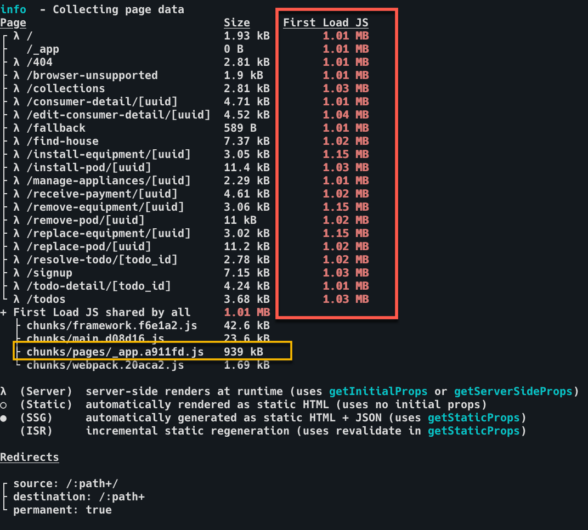
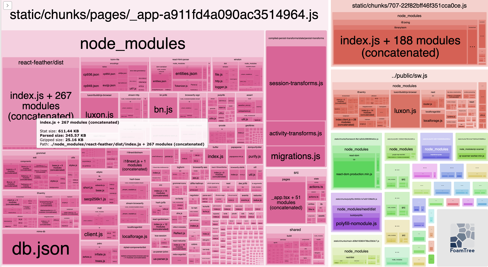
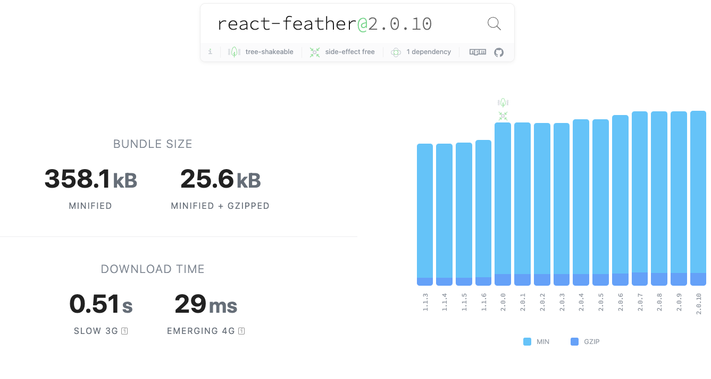
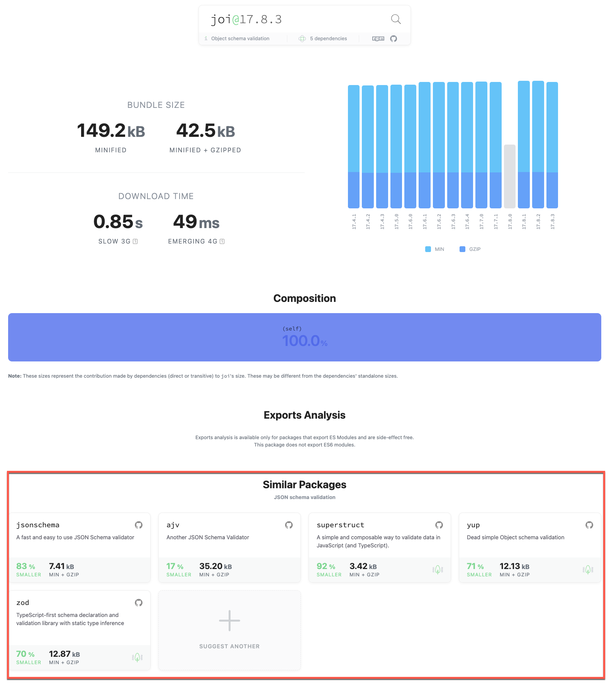
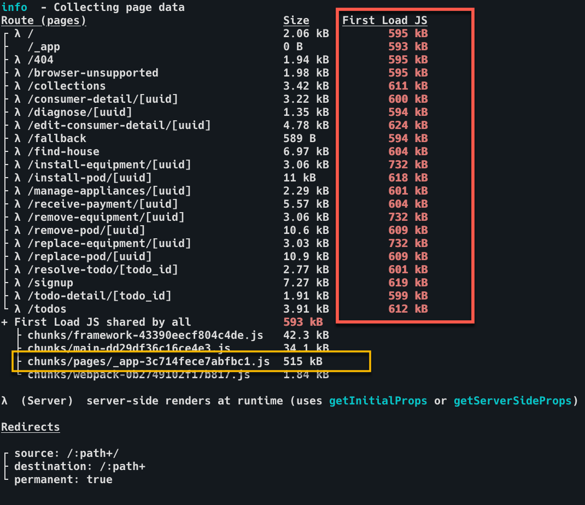
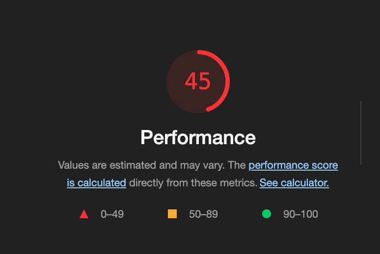
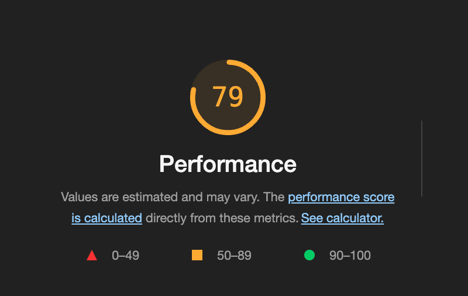

Since our mobile app is primarily used in areas with a slow or unstable network connection, ensuring that our JavaScript bundle is as small as possible is essential. We had a problem before where users opened the mobile app and were stuck on a white screen. We later found out that the issue is happening because they are downloading a huge JS bundle in a place with a slow network connection. We fixed this problem by updating our caching strategy and reducing our JS bundle size. This article will provide the steps we've taken to reduce our bundle size from 1.12MB to 590MB (almost a 50% reduction).

## What is bundling?

As a developer, you likely write several files for classes, functions, etc. These files are called modules. They are written that way for your code to be readable and reusable. Third-party packages that you install and import into your codebase are modules too.

When the NextJS application is built, these modules are compiled and merged into optimized browser bundles. The goal of bundling is to reduce the files the browser requests when a user visits a page.


As your web application becomes more complex and feature-rich, the size of your codebase will also grow significantly. It can be a deal breaker, especially if you're building an application optimized for offline or unstable connection since downloading an app with a huge bundle size might take a decent amount of time, especially if the user is in a location with poor connectivity.

## Bundle analysis setup 

### What is @next/bundle-analyzer?

`@next/bundle-analyzer` is a plugin that analyzes the size and composition of your app's bundle. The plugin generates a visual report that displays detailed information about every component/module on your codebase and its dependencies. It also includes all the third-party packages you've installed.

The information provided by this plugin will help you identify code that you can either optimize or remove, leading to a reduction in your bundle size.

### How to configure @next/bundle-analyzer?

You need to install the plugin as a dev dependency. You also be installing `cross-env`. It will enable you to set environment variables regardless of the platform you run the codebase with. To install all dependencies, just run the command below:

```sh
# NPM 
npm install --save-dev @next/bundle-analyzer cross-env

# Yarn
yarn add -D @next/bundle-analyzer cross-env
```

After you've installed the packages, you need to add the following code inside your `next.config.js` to enable running the analyzer.

```javascript
// For <= NextJS v11
// highlight-start
const withBundleAnalyzer = require('@next/bundle-analyzer')({
  enabled: process.env.ANALYZE === 'true',
})
// highlight-end

module.exports = withBundleAnalyzer({
  // your Next.js configuration
})

// For >= NextJS v12
// highlight-start
const withBundleAnalyzer = require('@next/bundle-analyzer')({
    enabled: process.env.ANALYZE === 'true'
})
// highlight-end

module.exports = (phase, { defaultConfig }) => {
    const nextConfig = {
        // your Next.js configuration
    }

    return withBundleAnalyzer(nextConfig)
}
```

You can add the following code to your `package.json` to make it easier to run anytime. 

```json
"scripts": {
    "analyze": "cross-env ANALYZE=true next build"
},
```

## Bundle Size Analysis

### What is your NextJS bundle size?

The first thing you need to do is to run `npm run analyze`. It will build your NextJS project. Right after you finish building your application, NextJS provides information on how many assets are downloaded on the server when you visit a page. 



Each value from the **First Load JS** column is the amount of data you will download from the server once you have accessed it. It is the bundle size per page. Your goal is to make these values as low as you can. NextJS advises aiming for the numbers to be colored green.

This is a screenshot of our app's build information before we had it optimized. You will see that all of the pages are greater than 1.01MB. It's because the First Load JS shared by all is already 939KB. It means that the shared code by all pages already exceeds 939KB. You can also see that the largest JS file is `chunks/pages/_app-b4eb19eba15f91e9.js`. We'll see the components of that file with the visual report generated by `@next/bundle-analyzer`.

### How to inspect your bundle?

`@next/bundle-analyzer` will generate and open visual reports in your browser during the build process. We will focus on the HTML file `.next/analyze/client.html`. It contains the size information of the modules the client downloads when accessing your web-based application. 

You will see a collection of boxes enclosed in bigger boxes with the name of each chunk. The larger the box, the larger the space it consumes in your bundle. Simply hover on any of the boxes to see its stats. You'll be able to see different sizes for each module:

- **Stat size:** The size of the JavaScript bundle when served to the client; this is the size of the JavaScript code that the client's web browser has to download and execute to run the app
- **Parsed size:** The size of the bundle after the web browser has parsed it; this is the amount of memory that the JavaScript code takes up in the web browser after it has executed the code
- **Gzipped size:** The size of the JavaScript bundle when compressed using the Gzip algorithm; this is the amount of data the client's web browser must download to run the app. Gzip is a standard compression algorithm used to reduce the size of web assets like JavaScript files. It can significantly reduce the amount of data transferred over the network



The screenshot above is the generated report for our application before it was optimized. Based on the report, our analysis is as follows:
- `react-feather`, supposedly just a library for icons, already takes 25.16KB of memory.
- `react-html-parser`, used only in one part of our codebase, takes up 36.66KB of memory.
- `compiled-persist-transforms` used for runtime type-checking of persisted data in local storage is bigger than our source code (`/src`).
- There are libraries we don't even use on the client side, e.g., `iconv-lite`, `mime-db`, and `elliptic`.
  
In our recent bundle optimization, we fixed most of these issues:

- `react-feather` is widely used in our mobile app, but we created a ticket to find other alternatives.
- Found a native way to do what `react-html-parser` does and removed the package afterward.
- Replaced `typescript-is` with zod. We need to have a separately compiled codebase because we use typescript-is, which requires a separate compilation to generate all the specific code to do runtime type-checking. `typescript-is` itself is only 918B, but the generated code is 40KB, and we expect this to increase as we add more types for checking. It was not scalable, so we replaced it with `zod`.
- Our shared codebase is currently not tree-shakeable. It means we still include unused shared code in our bundle. To fix this, we manually exclude packages not used in the mobile codebase. 
## Package Size Analysis

We must ensure that all the NPM packages we add to our dependencies are as small as possible. [Bundlephobia](https://bundlephobia.com/) provides information on how much data will be added to our bundle if we add a specific package to our dependencies. It would also provide a list of similar packages to help you find an alternative.



It was extremely helpful when we were looking for a replacement for `typescript-is`. I initially found `joi`, an object-schema validation package that doesn't need additional compile steps but is 42.5kB (larger than react-feather). Bundlephobia provided a list of alternatives. In the end, we ended up with `zod` a balance of acceptable size with all the features we need for runtime type-checking.



## Dependency List
We use different kinds of third-party packages to help us develop our applications. We keep the list of packages we use in packages.json. Three dependency lists can be found in packages.json. These are `dependencies`, `devDependencies`, and `peerDependencies`. Knowing the differences between these lists is essential to ensure we don't add irrelevant packages to our bundle. This [article](https://www.geeksforgeeks.org/difference-between-dependencies-devdependencies-and-peerdependencies/) goes in-depth in explaining the differences between the three lists.

Here are several key points that our team applied to our codebase: 
- Ensure you don't add packages only used in development in the dependencies list. If the package is only used for development, like Cypress or Storybook for testing, or during compilation, like Babel or webpack, that package belongs to the devDependencies list.  
We had an issue before where `jest` was included in our bundle. It is incorrect since `jest` is used for unit testing.

- We only use the peerDependencies list in the shared codebase since we treat it as a separate package. Packages that are both in our shared package and with either mobile or desktop, e.g., `react` or `styled-components`.

## Type-Only Imports

Since we extensively use TypeScript, there would be instances that you need to use types that are not included in the package you installed since they added another dependency but exclude the required types, or it's a JavaScript-only package. This kind of package might bloat your bundle.

A good example is `isomorphic-fetch`, which uses both `node-fetch` and `whatwg-fetch` but doesn't include the types used for these libraries. We needed the `Response` type, but it was not included in the isomorphic fetch, so we installed `node-fetch` separately. We found out that installing `node-fetch` separately added 161.67kB to our bundle size!

There are two ways to fix this:
- Only download the types for that package. For `node-fetch`, only install `@types/node-fetch`.
- Copy over the types you need and add them to the `src/@types` directory.

Another essential thing to note is always to use `import type` for types and interfaces. Any types and interfaces imported this way will be entirely erased and not included in the bundle. For a more detailed explanation, please take a look at the official [docs](https://www.typescriptlang.org/docs/handbook/release-notes/typescript-3-8.html#type-only-imports-and-export)!

```typescript
import type { Response } from 'node-fetch'
```

To ensure this way of importing declarations is fully implemented, we added the `@typescript-eslint/consistent-type-imports` lint rule in our `.eslintrc.js`. It would enable your IDE/lint to display an error if you forgot to use `import type` for declarations.

## Manually Excluding Packages
As explained earlier, the shared package is currently not tree-shakeable. It means we still include unused internal code and packages (mostly ones used only on the server side). It significantly bloats our JS bundle. We manually exclude packages from the bundle while waiting for enough resources to convert shared into a tree-shakeable package properly.

To manually exclude a package, you need to follow these steps:
- Open `next.config.js`
- Inside the `webpack` function and inside config.resolve.alias, add the package's name, and set it to false.

```javascript
    ...
    const nextConfig = {
        ...
        webpack: (config, { dev, isServer }) => {
            ...

            if (!isServer) {
                ...
                config.resolve.alias = {
                    ...config.resolve.alias,
                    'jszip': false,
                    'qrcode': false,
                    'async-mqtt': false,
                    // <-- Add the package you want to exclude here
                }
            }
         }
         ...
    }
}
```

## Conclusion

We covered a lot! After we had done all the optimizations above, we decreased our bundle size from 1.01MB to 593 MB. That's a >40% bundle reduction. We also increased our lighthouse performance score from 45 to 79!







To summarize, here are the steps we take to manage and optimize our bundle size:
- Regularly do bundle analysis.
- When adding new packages, use `bundlephobia` to pick the most optimal package.
- Ensure to add new packages in their correct dependency list.
- Only use type-only imports and exports for TypeScript types and interfaces.
- If all else fails, manually exclude unused packages.

I hope this article will help trim down and manage your own JS bundles! 