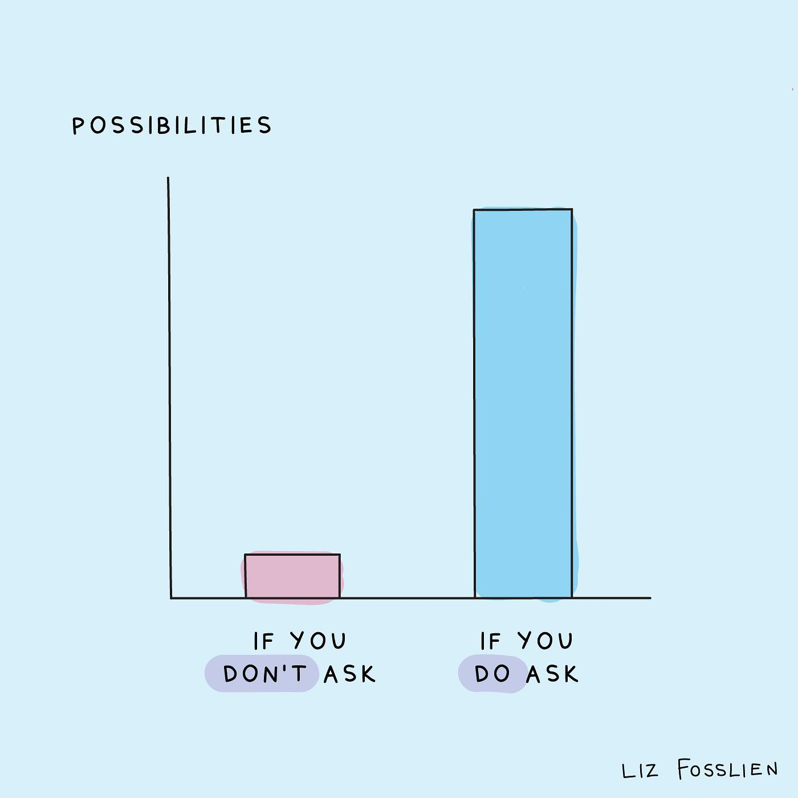
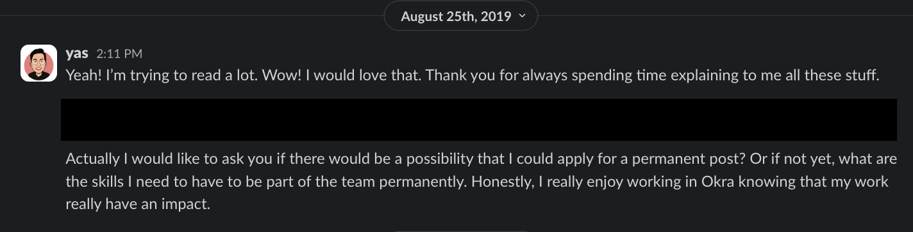
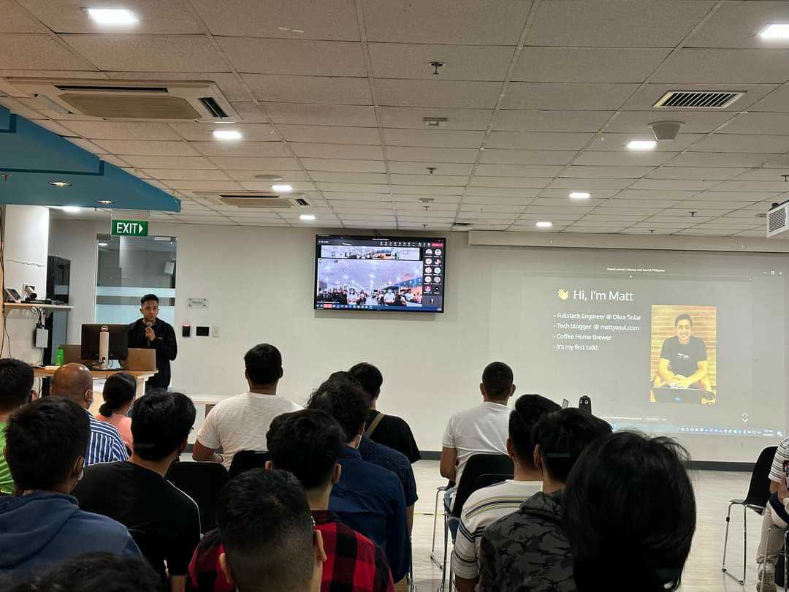
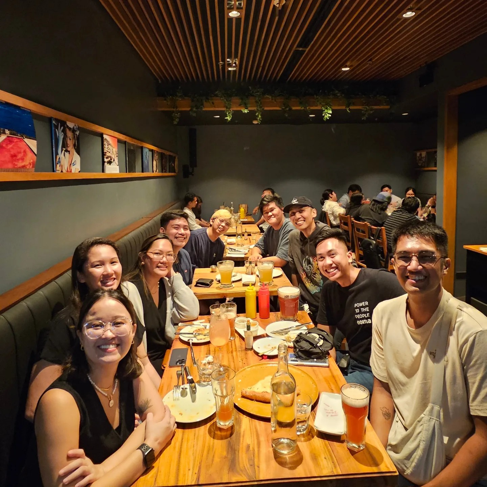

Like most Filipinos, I am extremely shy and nervous when I want something, especially about work or my career. I tend to focus on the quality of my work and hope that my peers or superiors will notice. I learned the hard way that most of the time, you need to assert yourself for them to take notice. I learned that you need to tell them what you need openly. I wanted to share how being assertive and asking for what I want and need opened new doors for me.

## 🌟 New Opportunities

I took a couple of freelancing jobs while starting in programming. I fell in love with the work I was doing with one of my clients back then. I loved how my client gave me extensive feedback about my work for him and how I could make it better. I also loved how impactful his company's goal is (to eradicate energy poverty).

I knew I was still too junior, but I took the courage to ask my client, who is the CTO of the company, if they had an opening for a developer of my level and, if not, what skills I needed to build to be a part of their company. I was surprised that he came back to me with an offer! And that was the start of my career in the [coolest startup](https://www.mattyasul.com/blog/startup-challenges-rewards/) I ever worked with.

If you know in yourself that you have the guts and knowledge for the position that you want, there's no harm in trying to ask for that position. If they say you are not ready yet, you can always ask what you need to learn or improve to get that dream job!

## 💭 New Learnings

For the first few years in Okra, I was focused on building our web-based applications. It's not that I was getting bored with what I was doing. I had a lot of fun! I learned JavaScript, TypeScript, React, and all other front-end technologies on the job! But I wanted to level up my programming skills. I wanted to be a full-stack engineer (an engineer who can work both in the front-end and back-end).

During my one-on-one with my team leader, I asked him if he could give me more back-end-focused features. I didn't expect it, but he was delighted I brought up that subject. He told me it was also in their plans to hone me as a full-stack engineer, and he was happy that I wanted the same thing. Starting that quarter, he gave more and more back-end-focused features. He also included me in design and planning meetings. After N bugs and features, I can confidently say that I can work both on the front-end and back-end side of things!

There will come a time that you'll want to level up, and to learn more, but your superiors would only know that you'd like that if you proactively tell them! If that time comes, save your time, ask them if you can take a jab on that new feature, or try a different way to do the work you've always been doing the same way over and over again. It may surprise you that they also want the same thing for you!

## 🪴 New Experiences

I thought it would be awesome to share with my fellow PH web developers some of the stuff I learned from building production-ready web applications. One way to do that is to write blogs! So, I started this blog and wrote a few of the stuff I learned from work! 

I didn't stop there. I've always had stage fright, and I wanted to conquer that fear, so I contacted [ReactJS PH](https://reactjs.org.ph/) and asked if they have a slot for me in any of their upcoming events because I'm willing to do a talk. It's hitting two birds with one stone! I can conquer my stage fright and also share my learnings! They happily gave me a slot and had my talk finalized!

Shivering and full of stutters, I finished my first talk (it was about [JS bundle management](https://www.mattyasul.com/blog/nextjs-bundle-management/))! There are a lot of things I still can improve upon, but I'm always glad I did that talk! Many experiences are accessible with a simple request. Knock the door, and it will be opened.

## 🤝 New Connections

I've always wanted to build a network with other programmers, but it got so hard to do when COVID-19 started. So when dev events began popping out, I just went out there and joined the first one that I could join! I knew joining or talking to an event wouldn't cut it. I need to join a group in a more relaxed environment like lunch or dinner.

So when the ReactJS PH's Rehackt event was about to finish, I went out of my way and talked to one of the organizers. I asked her if they were having dinner somewhere after the event and if they would mind if I joined. She gladly tagged me along! They even joined in the car to ensure I won't get lost! It was awesome hearing their stories inside and outside software programming!

Building new connections has a lot of benefits, from being up-to-date with the latest trends, sharing ideas, and promoting self-esteem to developing long-lasting relationships. Next time you're in an event, put yourself out there! If you see a group you want to be a part of, ask them if you can join them for lunch or dinner! It's always good to build new connections and make new friends.

## 🏁 Wrapping Up

If you want to build that new feature, speak up! If you want to get that promotion, speak up! If you want to do that brown bag session, speak up! If you want to be a part of that group, speak up! You'd be surprised with how willing most of the people around you are to help you out. You just need to ask them first. It's up to you to open that door to endless possibilities.