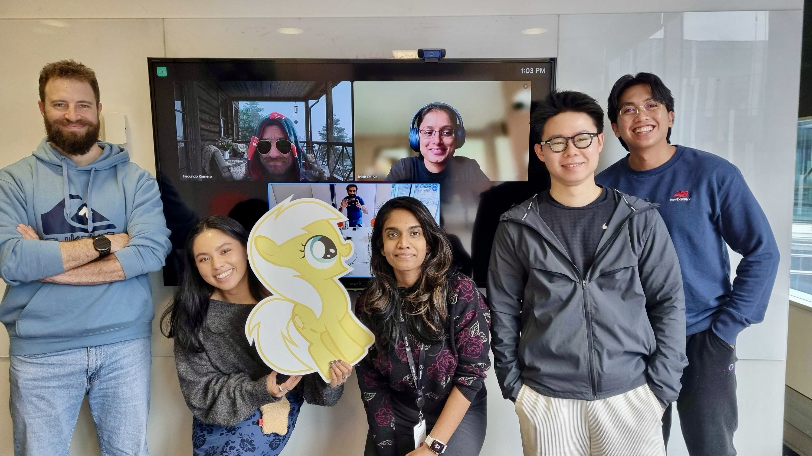

2023 was the most difficult, traumatic, and challenging year of my life. Despite the hardships, I was hopeful, eagerly anticipating what 2024 would bring. And guess what? 2024 did not disappoint. It turned out to be a year of growth, rediscovery, and countless lessons. This blog is my way of reflecting on the year and sharing the exciting journey I've been on!

---
### **Moved to a New Country and Started a New Job**

After nearly two years of searching for opportunities, preparing for interviews, gathering documents, and securing a visa, I finally moved to New Zealand! Starting a new job is nerve-wracking enough—imagine doing it in a completely different country!

Thankfully, I found a flatmate and a place to stay in the central district even before arriving. Shoutout to my flatmate for helping me settle in! While I usually experience culture shock when visiting new countries, this time I was _weather shocked_! Arriving in the middle of summer, I quickly learned that "New Zealand summer" and "warm" don’t always go hand in hand. My mom packed only a thin blanket, so I spent the first week shivering until I figured out the magic of comforters, duvets, and puff jackets.

The new job came with perks—a well-stocked pantry and friendly colleagues! My buddy at work, Jem, was Filipino, which made the transition even smoother. Moving from a startup to a large corporation took some adjustment, but everyone was welcoming and supportive. (I'll share more about this experience in a future post—stay tuned! 🙏)

---
### **Leveled Up My Cooking Game**

In New Zealand, eating out is outrageously expensive—a decent meal costs around 20 NZD (660 PHP)! To save money, I decided to cook my own meals, which also helped me manage my diet and lose weight by year’s end.

To my surprise, I discovered that I _love_ cooking! Like software engineering, it’s a constant learning process. Did you know you can use breadcrumbs to thicken sauces? Or that soups taste better when you stir-fry the ingredients first? I even mastered the art of making the perfect runny boiled egg—just boil it for exactly seven minutes!

This year, I cooked dishes I’d usually order at fancy restaurants, like steak and salmon, and comfort foods like mapo tofu and galbijjim. When friends from Singapore visited, we saved a fortune by eating home-cooked meals. Seeing my friends enjoy my food gave me a newfound appreciation for my mom, who always asked if I liked what she made. (Yes, Mom, your food is amazing!)

---
### **Built Meaningful Connections and Reconnected with Old Friends**

Moving alone to a new country can be lonely, but the company of old and new friends made it all bearable. I reconnected with a batchmate from my previous job at a church mass, which led to meeting more Filipino friends (thanks, Angel!). My aunt also introduced me to her former superior, and they invited me to celebrate holiday events with them (thank you, Tita Marlene!).

At work, I forged great friendships with colleagues who shared common experiences—we were all from different countries, most of us were Asian, and a few of us were only children. Together, we hiked, dined out, and bonded over poker nights. These connections not only made life more enjoyable but also helped me navigate my new surroundings. I’m truly grateful for these wonderful people.

---
### **Explored New Zealand’s Natural Wonders**

I’ve always been a nature lover. Back in the Philippines, I saved up and used vacation days to explore its vibrant landscapes. New Zealand, with its stunning scenery, felt like a natural extension of that passion.

This year, I hiked several trails in the North Island, experienced snow for the first time at Ruapehu, visited Hobbiton’s Shire, and marveled at the magical road to Milford Sound in the South Island. These adventures were just the tip of the iceberg. I can’t wait to move out of the city and get my own car to explore even more!

---
### **Rediscovered and Loved Myself More**

The most transformative part of 2024 was learning to prioritize and love myself. For years, I focused on the needs of others—something that gave me fulfillment but often left me neglecting my own. Living alone gave me the opportunity to rediscover my passions and treat myself.

I invested in things I usually wouldn’t: a decent guitar, shoes I’d always wanted, and a cool workspace setup. I also made time for hobbies like playing fingerstyle guitar, reading, and going to the gym.

One of the biggest leaps I did was conquering my fear of public speaking. I enrolled in Toastmasters’ Speechcraft course, where I gave weekly speeches. It was terrifying at first, but with each week, I grew more confident. Huge thanks to my employer, Pushpay, for sponsoring the course!

---
### **Plans for 2025**

In 2025, I’m determined to spend Christmas and New Year in the Philippines with my family. To make this happen, I’ll save money and vacation leaves. Career-wise, I aim for a promotion and plan to write more blog posts while building side projects.

Here’s to another exciting year ahead. Happy New Year to each and every one of you! 🎉