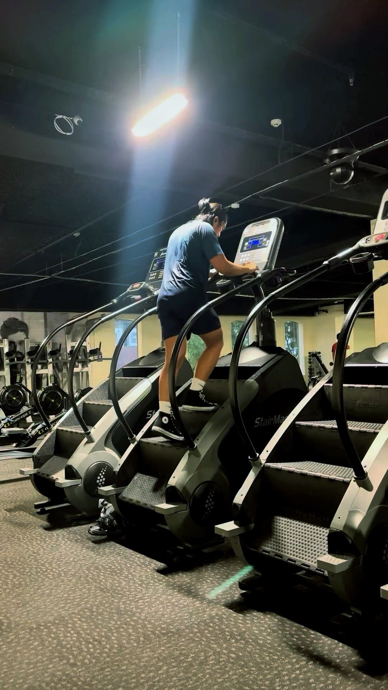

For those who know me, I joke a lot, but I take health very seriously. When I came to New Zealand, one of my goals was to be the best, most healthy version of myself possible. But I noticed that as months went by, instead of becoming fitter and healthier, I started gaining weight. I remember hiking with a friend, who spent most of the time waiting for me because I was constantly catching my breath and suffering from back pains. I felt incredibly heavy throughout that hike—and mind you, I was already going to the gym four to five times a week!

After my trip to Singapore and the Philippines, I checked my weight again, and to my horror, I'd gained even more (though it shouldn't have come as a surprise given how I binge ate almost every day while I was there!). Bask in the presence of my heaviest self. I'm at my heaviest here, at around 82kgs.

Then and there, I had my personal "enough is enough" moment. I decided to take my "best version of myself" goal more seriously. If Hollywood stars could transform their bodies with dedication and the right approach, I could too. So I did. Well, I tried.

As of today, I've lost more than 12kg! From my heaviest at 82kg (180.4 lbs), I'm down to 69.7kg (153 lbs)! I thought it might be useful for others looking to lose weight, so I'll share what worked for me. Don't worry, they are really simple!

## I ate less

But what does "less" mean? Your body burns a specific amount of calories based on your weight, height, age, and activity level. This is called Total Daily Energy Expenditure (TDEE). If you want to know yours, ask ChatGPT or use [Gym Geek's Calorie Calculator](https://gymgeek.com/calculators/calorie-calculator/) and input your measurements and how many days you exercise.

My TDEE was around 2,500 calories a day. I learned that the best and most simple way for me to lose weight is to eat less than what my body burns—a caloric deficit. And the best way to track this is to count your calories. I use the Chronometer app on my iPhone to track my calories.

I know, counting calories seems tedious and like too much work. It is at first. But if you're like me and eat similar foods throughout the week, you only need to calculate once a week. Eventually, you develop the skill to eyeball calories: a bowl of rice is around 200 calories, a slice of pizza is about 280, and a McDonald's quarter pounder is about 500.

Understanding the caloric content of food creates mindfulness about what you should or shouldn't eat.

I also learned it's not just about eating less overall—it's about eating less of specific things. Ideally when you're losing weight what you really want is to lose fat. Surprisingly, it's more important to reduce carbs than fat, because carbs—especially simple and starchy ones like soda, pasta, pastries, and candies—convert to glucose, which triggers insulin production. Insulin stops your body from burning fat and converts unused glucose into stored fat.

While losing fat, you also want to maintain muscle mass (which burns more calories than fat). The more muscle you have, the more calories you burn, even at rest! To maintain muscle, you need adequate protein—1.2 to 1.6 grams per kilogram of body weight.

## I cooked more

Restaurant meals are expensive and complicated to track calorie-wise since you can't weigh the food. So I started cooking at home! Besides saving money, I could weigh ingredients and swap out calorie-dense items for lighter alternatives. For example, I chose leaner cuts of meat and used less oil.

Cooking made it easier to experiment with my diet. I gradually decreased my carbohydrate and fat intake, increased my leafy greens (which make you feel fuller longer), and switched from rice to potatoes.

Pushing myself to cook regularly made me discover that I love it! Like software engineering, you learn something new daily and "build" something from various "ingredients." And as I practiced, my food became more and more edible!

## I skipped breakfast

Intermittent fasting offers many benefits, but I'll focus on weight loss. As mentioned earlier, my goal was to lose fat. Our bodies prefer glucose as an energy source, but we can only store relatively little glucose compared to fat. Fasting quickly depletes glucose, forcing your body to turn to fat for energy—burning and losing it in the process!

So my daily fasting routine is to drink a cup of coffee after I wake up (around 5 to 6 AM), then drink green tea around 10 AM, and have my first meal around 2 PM. I will occasionally have some light snacks afterward and have my dinner around 7 PM.

It will be relatively hard at first—it took me about two weeks to stop feeling hungry in the mornings—but you can start from a 12-hour fast and extend the fasting hours as your body gets used to it!

## I walked up the stairs

I noticed that my body was not losing weight as fast as I wanted, so I incorporated cardio into my workout routine. The poison that I picked is the Stairmaster! Based on my experience, it's the most efficient way to burn a lot of calories without incorporating a lot of movements like HIIT, rowing machine, or the assault bike (aka the "death" bike).

I normally would set it to speed around 9 (this was the fastest; I started at 6) and would set it at a lower pace (around 4) at the 20th minute for one minute to give me some time to catch my breath and finish my cardio when I burn 415 calories (I will do a cooldown from the 400th to the 415th calorie at around 4 speed).

Honestly, it's not easy. It takes a lot of willpower to finish a Stairmaster workout. I always bring my best playlist to make it a bit easier! I'm always so proud of myself after finishing a Stairmaster workout!!

If you're just starting out, begin at a lower speed (3-4) for shorter periods (10-15 minutes) and gradually increase as your fitness improves.

## I showed up

All of the previous steps would only matter if I showed up consistently. You don't need to be a rocket scientist to do them, but what I know is they require hard work. You need to show up consistently. Even if you are tired, even if you are sleepy, even if you are not in the mood—if you want to see results, you need to show up and do the work. And that's what I did.

What got me through was seeing my progress. I made a promise to myself to be the best that I can possibly be, and when I feel like not going or eating more than I should be eating, I always think of my future self and how I'm robbing that future me of the opportunity to be the best him he could possibly be. So I just do it.

## Results

As an engineer, I need data to back up my claims, so here are the results from my weight loss journey:

From July to November (four months), I lost only 2kg while irregularly consuming above my 2,500-calorie TDEE. But my weight dropped dramatically when I started consistently eating below that threshold! From November to February (three months), I lost 6.35kg—a 300% improvement! You'll notice my fat intake remained pretty consistent; most of my calorie reduction came from carbohydrates. So I can confidently say that the steps I listed actually works!

Now, for the moment you've all been waiting for... after losing more than 12kg, drumroll, please!!! 🥁🥁🥁

Sorry, sorryyyyy. I know he's too handsome (and white) to be me. Alright, here's my actual transformation:

 
 

## Conclusion

Thank you for sticking with me till the end! So there they are! The five simple steps that I followed to lose more than 12kgs! They are simple, but hell, they are not easy to follow every day. One scene from a KDrama I'm watching (Extraordinary Attorney Woo) really resonated with me regarding losing weight. Most of the solutions to our problems are really obvious. The hard part is actually doing them.

This mindset shift was crucial for me—understanding that weight loss isn't about finding some secret formula but rather committing to the simple, proven approaches and showing up day after day.

Now that you have all the tools you need, one question I'll leave to you is, "How bad do you really want it?" I believe you have what it takes to achieve your goals, as I did mine.

If you have questions or comments, please leave them in the comment box, or feel free to contact me on my social media!