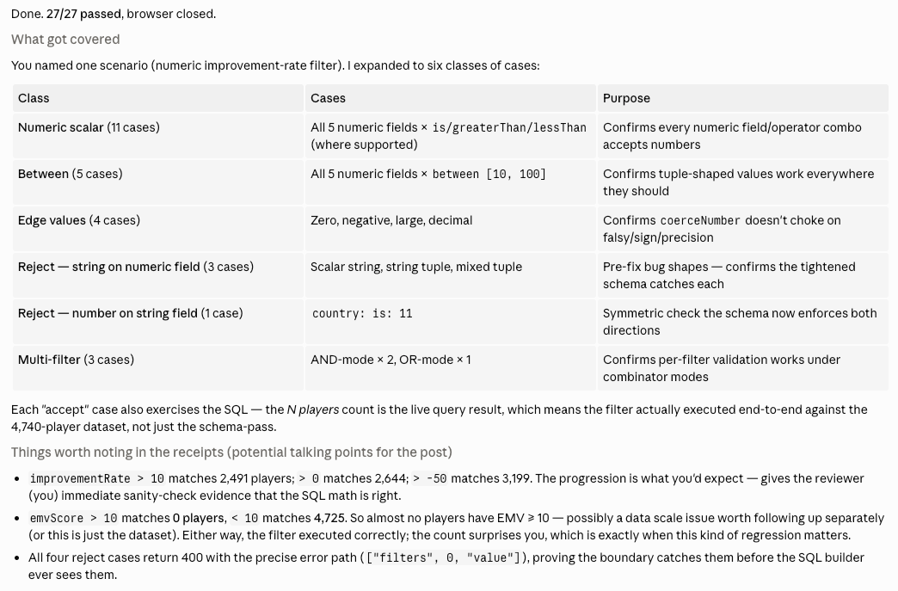
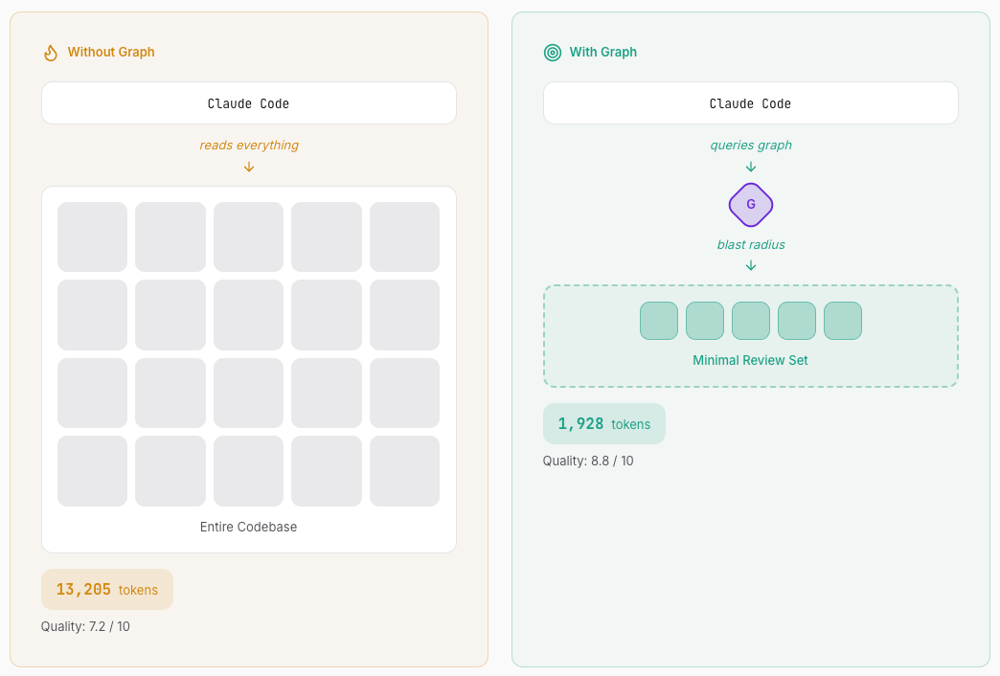

Two months ago, I led our team to build an app that finds budding and talented golfers from all over the world. After endless nudges from my dear friend Moravy, I went all-in on agentic development from day one. We shipped to production last week, and there's no PR where AI was out of the loop.

But my biggest realization is that working with AI agents is closer to managing a team than writing code. They perform when you give them the right tools and support, the same way an exceptional manager does for their team. This post is about the tools and practices that I built for the agent that actually worked for me.

### Handing the agent a contract

Before I knew about [SDD](https://martinfowler.com/articles/exploring-gen-ai/sdd-3-tools.html), I used AI as a rubber duck and wrote most of the code myself. When I tried to hand the rails over, the agent over-engineered things or built something subtly off from what I had in mind, and the corrections cost more than just writing the code directly.

Everything changed after I started using SDD. The spec is a contract the agent follows, and writing it (with the help of either the agent or [spec-kit](https://github.com/github/spec-kit)) forces me to think the feature through before any code is written. The user stories give me something I can hand to my lead and ask, "Is this what you expect?"

The more I used it, the more I realized SDD is a methodology, not a checklist you follow to the T. A full-cycle pass on foundational pages was extremely helpful, but it felt overkill for smaller features. After several iterations, here are the two modes I've been using:

- **Full-cycle** - spec, plan, research, data model, contracts, quickstart, and tasks. For features with new data shapes and contracts. I used this on the foundational pages of the app, where everything downstream rested on what those specs locked in. This led to massive PRs (sorry, Warren!). If I were doing it again, I'd break the PR into smaller ones along the phase boundaries in the tasks file.

- **Slim** - I ask the agent to refer to a previous spec for the format, then generate spec, plan, and tasks files. The tasks are usually grouped into deliverable phases that each land as a separate ticket and PR. I used this recently for an internal feature-flag system: I ship the spec as a doc-only PR before any code, then land each phase in its own small PR. This made the review process more manageable.

Slim is what I default to now. The spec gives the agent the contract, while the Linear sub-tickets give my team a place to push back before code ships. This combination is what works best for me.
### Extending the agent into the tools you already use

As software engineers, we have many responsibilities beyond writing code. We create tickets for upcoming work, write PR descriptions when changes are ready, and write documentation once features finally ship. The list goes on.

But as they say, work smarter, not harder. Luckily, we can ask our agents to do the heavy lifting for us either through MCP servers or CLI tools. The ones I use the most are:

- [Linear MCP](https://linear.app/docs/mcp) for creating and updating tickets. I rarely write a ticket manually anymore. Once I've finalized the implementation details from planning, I ask the agent to draft the ticket. And because it already has the context, the details all land on the ticket without me having to repeat them.
  
- [GitHub CLI](https://cli.github.com/) (`gh`) for any GitHub-related actions. Pair it with a PR template, and you'll never write a PR description manually again.

- [Playwright CLI](https://playwright.dev/agent-cli/introduction) for regression testing. Whenever I fixed a bug, I would usually test the main scenario to ensure the fix works and ask the agent to come up with related edge cases on its own, and have it run against a real browser. It comes back with a report that includes what it covered, what passed, and what didn't.
  

There are a lot of MCP servers and CLI tools out there, and it can feel overwhelming. A good way to figure out what you actually need is to list the tools and services you use daily, JIRA, Confluence, Slack, whatever, and check if they have either an MCP server or a CLI tool (they usually do). Being able to delegate the nitty-gritty (ahem, documentation) frees you up to do the things that actually excite (hand me that next tech debt already!).

### Packaging the things you keep explaining

A few weeks into the project, I noticed I was explaining the same things to the agent over and over again. "When you delegate to Codex, create the worktree, provide the tasks concretely, and add verification steps to know when the task is done.", "Before you create the manual database migration script, check the journal.", "When extracting this component, do this, and then do that, yada yada yada". Same explanations for each new session.

And then I found out this magnificent agent feature, which they call "skills". A skill is just a markdown file with a name, a description, and a body. It's agent-readable, version-controlled, and discoverable by both Claude Code and Codex. Once it's written, the agent loads it automatically when the work matches the description. I don't have to explain myself anymore; the agent finds it on its own.

The ones I use most often are:

- **`database-changes`** - every DB-touching task loads this automatically. Covers generating manual migration scripts, handling Drizzle-specific quirks (e.g., materialized views not fully supported, script ordering, etc), and debugging performance queries.

- **`codex-handoff`** - the workflow for delegating implementation work to Codex while Claude stays focused on coordination and review. I wrote it after doing the same delegation pattern four times across separate PRs and noticing the same two token sinks recurring.

- **`ui-component-extraction`** - the cross-repo workflow for extracting generic UI primitives from our React repos into our shared UI library. Codifies the three-phase contract (simplify, move, consume) plus the audit step that decides what's library-worthy vs. what stays app-local.

You can also adopt other people's skills. Playwright CLI ships with one (`playwright-cli install --skills`). Vercel publishes React skills I use whenever I work on the frontend. There are a gazillion skills out there, and you can find them on [https://skills.sh](skills.sh/).

Skills solved my problem of repeating myself to the agent. Write it once, and every future session benefits.

### Making your agent read what matters most

I kept hitting my Codex token limit from early April 2026, when they [switched from usage credits to token-based rates](https://arc.net/l/quote/wnzaplqc). I had to research how to optimise my token consumption. I found that when you ask an agent to _"refactor the filter engine,"_ it runs a text search (`grep`) for the word "filter" and reads matching files, sometimes in full, and every line containing that string lands in its context. Imagine doing a "find all" in your IDE and reading every match one by one to check whether each is relevant to the task. Those greps ate my tokens for breakfast.

Two tools helped me solve this:
- [code-review-graph](https://code-review-graph.com/) - answers _"if I touch this file, what tests, components, and routes are affected?"_ by pre-computing the dependency graph of the codebase. It's like "Find all references" in your IDE, but smarter.
  

- [Serena](https://oraios.github.io/serena/01-about/000_intro.html) - gives your agent IDE-like tools. Imagine upgrading the agent from a notepad to Cursor or VS Code. It can do things like _"Go to definition"_ and _"Go to implementations"_ on real symbols rather than text matches.

As I've been continuously using them, I noticed that it didn't just save me tokens, it also gave me higher-quality output, because the tools filter out the noise that grep would otherwise dump into context. The smaller the context the agent loads, the cheaper the run and the sharper the output.
### Building your own tools

Being able to write code faster means that writing internal tools has also gotten cheaper. I've built a handful of internal tools so the agents fit my workflow better:

- **A multi-repo workspace** where all our repos live as siblings under the same directory. Skills, hooks, and conventions live at the workspace level and propagate into each repo. This lets the agent move between repos easily, without me re-sharing context every time.

- **A worktree script** that lets me create git worktrees at the workspace level. Let's me spin up multiple agents in different repos in parallel.

- **A feature-flag CLI** that enables the AI to create feature flags and wrap code in them without any manual intervention.

There's still a lot to be done. I recently noticed we can save tokens by migrating from MCP servers to CLI tools. I also still need to tighten our guardrails so that Claude can properly spawn Codex agents.  The system needs constant maintenance. There will always be rough edges. 

### Conclusion

The needs of your agents vary, just as every team member has different needs. Agentic development isn't going away, which means being a good engineer isn't enough anymore. You need to be a good agentic _"manager"_ too.
