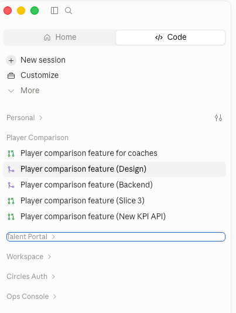
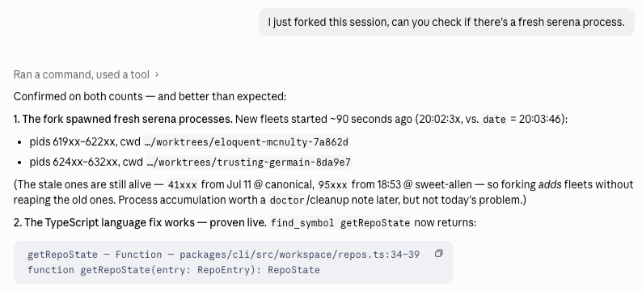
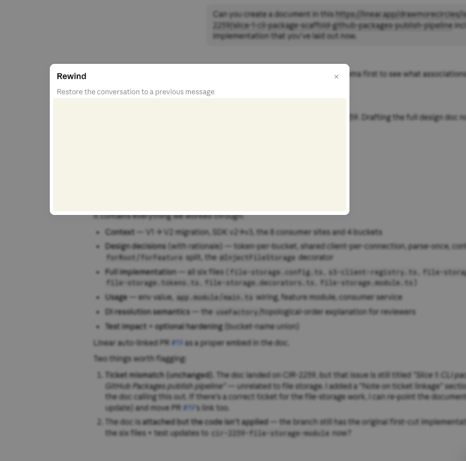
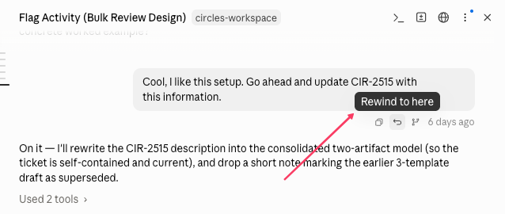
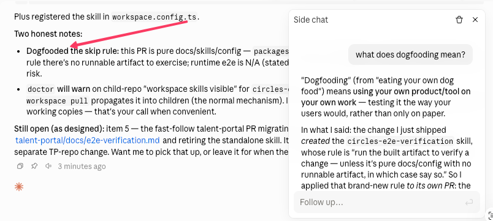

I work at a [startup](https://drawmorecircles.com/) where most of our features cut across the whole stack: migration scripts, backend, frontend, and infra. These days AI writes about half my code (the other half is still hand-crafted by yours truly, sorry, vibe coders!), and it plans most of it with me too.

But after months of living in Claude Code, I've learned that the real skill isn't just prompting; it's **context management**. Your agent is only ever as good as what's in its head _right now_. The three slash commands I use most are all, at their core, context control-flow: `/fork` branches it, `/rewind` rolls it back, and `/btw` keeps it clean. Let me walk you through how I use each one.

_FYI: these are slash commands, so on the CLI you'd type them straight into the terminal. I mostly live in the Claude Code desktop app, though, so that's the angle I'll show._

# 🔱 `/fork`

When a feature has many moving parts, my most-used slash command is `/fork`. It spawns new agents/chats from a source agent, and each spawned chat carries the source's full context.

Take our leaderboard feature: it spanned design, frontend, backend, and our analytics engine. I started one agent to plan the high-level implementation, and once I was happy with the approach, I forked it into separate agents to dive deep into each part. Every one of them already knows the full plan.



The Claude Code desktop app pairs with this nicely. I rename each spawned agent after the part of the feature it owns, so I can always find my way back to the right conversation without getting lost.

I recently found another use for forking: a "restart" button. Normally, when you make configuration changes, say you edited `.mcp.json` to add an MCP server or update a token, you would need to spawn a new session for these changes to take effect. This also applies to MCP servers with local configuration (e.g. we use local LSP servers) Fork instead: you get the restart _and_ keep the context.



# ⏮️ `/rewind`

Ever said something you didn't mean and wished you could take it back? (To your agent, I mean.) `/rewind` is exactly that. It rolls the conversation back to an earlier point. Everything after it drops out of the agent's head, so you reclaim those tokens too. And it's not just the chat: `/rewind` can roll your _code_ back to that checkpoint as well. Undo for the working tree, not only the conversation.

I usually reach for it after trying an implementation approach that turned out sub-optimal: rewinding sends me back to the drawing board with an agent that isn't biased by the dead end.

On the Claude Code desktop app, typing `/rewind` opens a modal where you pick the message you want to go back to.



Or scroll up to the message you want to return to and hit its "rewind" button directly.



# 🤷🏽 `/btw`

```bash
/btw <your question>
# /btw what does dogfooding mean?
```

Curiosity killed the cat; for me, it kills my context. There would be instances where I'm intensely (I hope my boss sees this) working with an agent mid-task, and then it will mention something I don't understand, a phrase I just encountered, an unfamiliar syntax, or some sub-optimal existing code. Curious cat that I am, I ask about it and tumble down the rabbit hole until I understand it fully, wrecking that agent's context on the way.

Finding `/btw` was a lifesaver. It lets you ask side questions without disrupting the main agent's flow. The agent answering your side question can see the full context of your main session, so it actually understands what you're asking about.

On the desktop app, it opens a side chat you can keep as its own conversation. It has limited access to tools and MCP servers, but for my endless stupid questions, it's perfect. (Yes, I had to ask what "dogfooding" means. lol)



# Wrapping up

For me, `/btw`, `/fork`, and `/rewind` are slash commands for my context management toolkit, each having distinct uses:

- <p><strong>/btw is my curiousity quencher.</strong> Every mid-task question that doesn't need tool access goes here. The side chat sees your whole session but can't disturb it.</p>

- <p><strong>`/fork` is my parallelization engine.</strong> Spawn it when you need full, tool-enabled sessions, parallel deep-dives across a feature, or a context-preserving restart after a config change, without touching the original session.</p>

- <p><strong>`/rewind` is my pocket time-machine.</strong> Back out of a dead-end approach, and it rolls the conversation _and your code_ (**optional**) back to the checkpoint.</p>

The developers who get the most out of Claude Code aren't just the ones with the best prompts. They're also the ones who treat the context window like the scarce resource it is. Every token in there is either signal or noise. These three slash commands are how you keep the ratio in your favour.

AI writes and plans a lot of this with me now, but deciding what it gets to remember is still very much my job.

**Wrong turn? `/rewind`. Parallel work? `/fork`. Side quest? `/btw`.**
